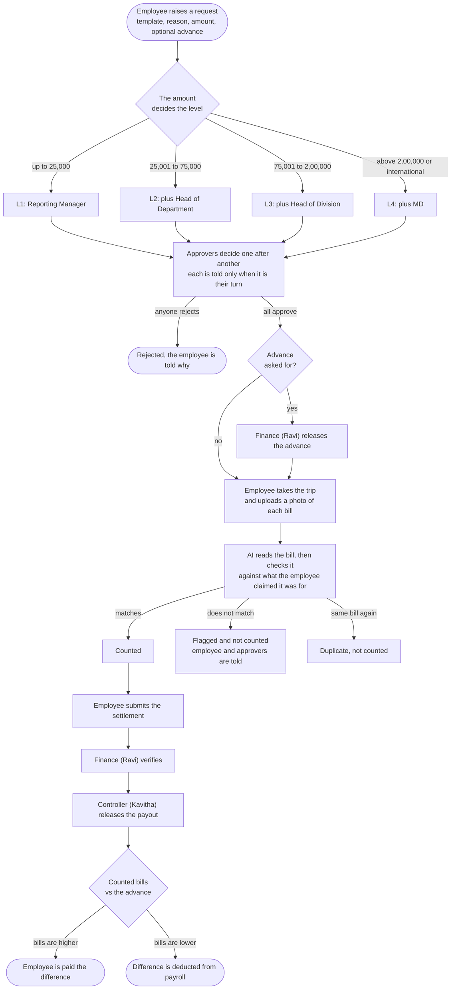
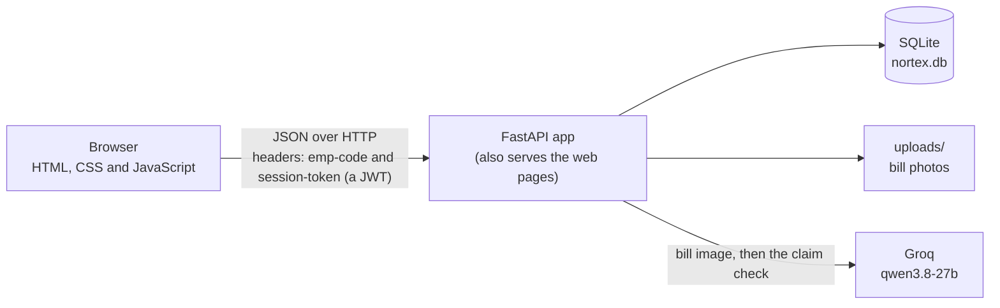

# Nortex travel reimbursement

A web app that takes a business trip from **request** to **payout**: the manager chain approves it by amount, Finance releases the advance, the employee uploads photos of bills, an AI reads each bill and checks it matches what was claimed, and Finance pays out. The employee always sees where the claim is and who has it.

## Demo

<!-- To make GitHub play the video right here: open README.md on github.com, click the pencil, drag video/demo-small.mp4 into the editor,
     and replace the image line below with the link it generates (github.com/user-attachments/assets/...). -->
     
[](https://github.com/user-attachments/assets/35dd2dc7-8ac9-4972-a80b-4e2ad15d69c9)

*3 min 51 s, no sound. Click the picture to play it (a 6 MB copy). The full-quality recording is [video/demo.mp4](video/demo.mp4).*

**Live app: <https://nortex-reimbursement-production.up.railway.app/>**

Log in with any account below. The password for all of them is `nortex123`.

| Email | Role | What to try |
|---|---|---|
| `chaitanya.reddy@nortexindustries.com` | Employee | Raise a trip or a meal claim, upload bills |
| `suresh.iyer@nortexindustries.com` | Reporting Manager | First approver for the sales team |
| `meera.krishnan@nortexindustries.com` | Head of Department | Second approver (claims above 25,000) |
| `arvind.rao@nortexindustries.com` | Head of Division | Third approver (claims above 75,000) |
| `nandita.shah@nortexindustries.com` | MD | Top approver (above 2,00,000 or international) |
| `ravi.menon@nortexindustries.com` | Finance | Releases advances, verifies settlements |
| `kavitha.balan@nortexindustries.com` | Finance Controller | Releases the payout |
| `admin@nortexindustries.com` | Admin | Read-only view of every user, template, claim, approval and notification |

Also in the data: Deepa Nair and Imran Qureshi (employees). To see the whole flow, use two browser windows, one signed in as the employee and one as the approver.

> The live site restarts empty whenever it is redeployed (see [Where it breaks](#where-it-breaks)), so any claim you make there is temporary.

## How it works

### One claim, start to finish



### What runs where



One container runs the whole thing on port 8000: the API and the web pages.

## The logic

**Who approves (L1 to L4).** The amount (the estimate for the request) picks the level. For that level the app lists the roles: the **Reporting Manager** is the person in the employee's `reporting_manager_code`; the **Head of Department** is the person with that role in the employee's department; there is one Head of Division and one MD. People who are missing, listed twice, or are the claimant themselves are dropped, so nobody approves their own claim (policy 2.2). The result is shown to the employee as a chain.

| Level | When | Approvers, in order |
|---|---|---|
| L1 | up to 25,000 | Reporting Manager |
| L2 | 25,001 to 75,000 | + Head of Department |
| L3 | 75,001 to 2,00,000 | + Head of Division |
| L4 | above 2,00,000, or any international trip | + MD |

**Advance.** At most 60% of the estimate; it is checked when the request is raised. Money is never released automatically: after the last manager approves, the claim goes to Finance (Ravi), who releases it.

**Bills.** Each photo (PNG or JPEG, up to 5 MB, checked by its real file type) goes through two AI calls on the same model:
1. *Read the bill*: it sees only the image and returns structured JSON (merchant, bill number, date, total, who paid, items). The employee's claim is deliberately not shown, so it cannot bias the reading.
2. *Check the claim*: it gets what the employee claimed (for example "Meals") and the JSON it just read, and says whether they fit.

A bill that does not fit is kept as **flagged** and not counted, and the employee and everyone who approved are told. The same bill (merchant, bill number, date, amount) uploaded again is marked **duplicate**.

**Money.** Only bills the employee paid for are reimbursed. `payable = bills − advance` if positive; otherwise `recoverable = advance − bills`, deducted from the next payroll. Payouts are scheduled for the next payment run, the 10th or 25th.

**Every claim states why.** Each template has a required "what is this for, and why is the money needed?" field. Approvers and Finance read it, and Finance can open the photo of every bill before verifying.

**Claim status** moves through: `pending_approval` → `awaiting_advance` → `awaiting_settlement` → `settlement_review` → `paid` (or `rejected`).

## Tech stack

| Part | Choice | Why |
|---|---|---|
| Language | Python 3.12 | Fast to write, readable |
| API | FastAPI | Typed endpoints, automatic docs at `/docs` |
| Validation | Pydantic v2 | The AI's answers and every request are checked before they are trusted |
| Auth | bcrypt password hashes, JWT (PyJWT) | Hashed passwords at rest; stateless signed tokens |
| Database | SQLAlchemy 2 with SQLite | One file, no server to run; money stored as exact decimals |
| AI | Groq, `qwen/qwen3.8-27b` (multimodal) | Reads bill photos and checks the claim, with JSON answers |
| UI | Plain HTML, CSS and JavaScript | No build step, easy to read and explain |
| Packaging | Docker | One command to run |
| Hosting | Railway | Runs the Docker image |

## Next steps

To make this a full product, these are what I would build next, roughly in this order:

1. **Real accounts.** A password per person (set on first login, reset by email) instead of one shared demo password; a login rate limit; logout that revokes a token; refresh tokens.
2. **A server database.** Move from SQLite to PostgreSQL, so data survives a redeploy and several servers can run; real migrations (Alembic) instead of recreating the file; bill photos in object storage instead of the container disk.
3. **Policy cuts at settlement.** Hotel per-night cap, daily meal cap, laundry and mini-bar lines removed from hotel bills, attendee names for hosted dinners, bills in someone else's name.
4. **Email receipts.** Read the text receipts in the inbox (cab, e-ticket, hotel folio), not only uploaded photos.
5. **Workflow gaps.** "Send back with remarks", a second approval on the final amount, the 7-day filing deadline, Finance people raising their own claims, duplicate checks per employee.
6. **Admin templates for real.** The "Create template" button is a mock today; make it save a new template with its own fields and approval steps.
7. **Operations.** More automated tests, logging, and email or chat notifications on top of the in-app ones.

## Run it locally

You need a free Groq key from <https://console.groq.com/keys>. It is only used to read bills; the rest of the app works without it.

### With Docker

```bash
git clone <this repository>
cd Nortex-Industries-reimbursement-portal

docker build -t nortex-reimbursement .
docker run --rm -p 8000:8000 -e GROQ_API_KEY=your-key nortex-reimbursement
```

Open <http://localhost:8000>. Press Ctrl+C to stop it.

Or with Compose: `GROQ_API_KEY=your-key docker compose up --build`.

Or run the published image without cloning anything:

```bash
docker run --rm -p 8000:8000 -e GROQ_API_KEY=your-key bharathsimhareddy18/nortex-reimbursement:latest
```

### Without Docker

```bash
python -m venv .venv
. .venv/bin/activate
pip install -r requirements.txt
export GROQ_API_KEY=your-key
uvicorn main:app --reload
```

Open <http://localhost:8000>. The database file `nortex.db` is created on the first start, with the people and the three templates already loaded. To start over, stop the app and delete that file.

Interactive API docs are at <http://localhost:8000/docs>.

Run the tests with `pip install pytest && pytest`.

## Where things are

```
ui/            the web pages and their JavaScript
apis/          the endpoints (thin: they call into src/)
src/           the logic: claims, approvals, policy (who approves), settlement, ai, auth, admin
config/        policy numbers (setting.py) and the employee list
video/         the demo recording (demo-small.mp4 is the light copy)
api_docs.md    every endpoint with real example responses
data_model.md  the tables and the rules behind them
```

## Where it breaks

This is a working demo, not a finished product. In plain terms:

- **Policy cuts are not applied yet.** Bills are paid in full. There is no hotel per-night cap, no daily meal cap, no removal of laundry or mini-bar lines from a hotel bill, no attendee names for hosted dinners, and no check for a bill in someone else's name. These rules are in the expense policy, and the app is structured so they can be added in the settlement step.
- **Emails are not read.** Bills come in as uploaded photos only (PNG or JPEG). The text receipts in the sample inbox (Uber, e-ticket, hotel folio mails) are not parsed.
- **No second round of business approvals** on the final claimed amount, and **no "send back with remarks"**: a claim is approved or rejected. The 7-day filing deadline is not enforced.
- **A claim by a Finance person** (for example Ravi's own expense) would stall, because the person assigned to verify it is the claimant.
- **The duplicate check spans all employees.** Two people with an identical ride that has no bill number would collide.
- **Security is basic.** Passwords are stored as bcrypt hashes and a login returns a signed JWT (12 hours), but everyone still shares one demo password, there is no login rate limit, and no logout that revokes a token. Set `JWT_SECRET` to keep logins valid across restarts (otherwise a new secret is made at each start). Every endpoint except login and `/health` needs a valid token (enforced for the whole app, with a test that fails if one is ever left open), and the API gives no cross-origin permission to other websites.
- **Data does not survive a restart.** SQLite and the uploaded photos live inside the container. Every redeploy starts empty.
- **Single server.** Only one automated test file (the login check above), no background jobs, no logging beyond the server output.

## More

- [NOTE.md](NOTE.md): the one-page note: what was built, decisions, and what is not done
- [api_docs.md](api_docs.md): the full API, with example requests and responses
- [data_model.md](data_model.md): tables, rules, and decisions
